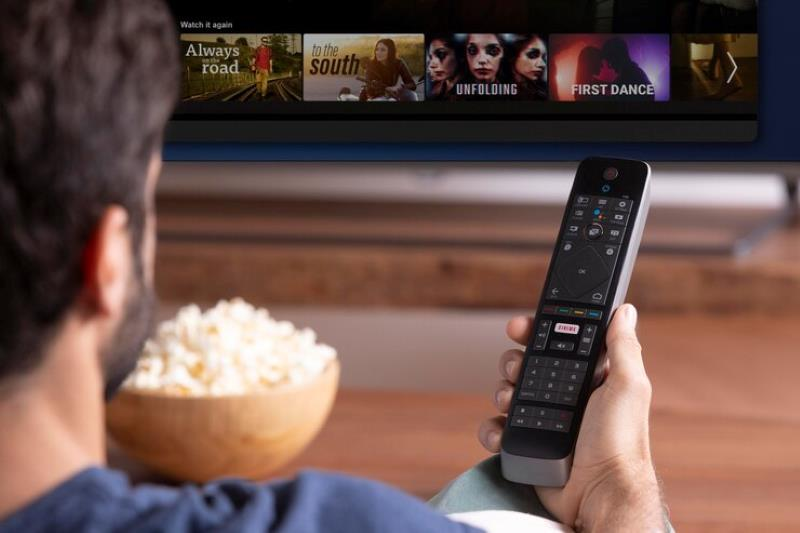

<html lang="pt-BR">
<head>
    <meta charset="UTF-8">
    <meta name="viewport" content="width=device-width, initial-scale=1.0, maximum-scale=1.0, user-scalable=no">
    <meta http-equiv="X-UA-Compatible" content="ie=edge">
    <title>IPTV Premium</title>
    
</head>
<body>
    <header>
        <h1>Bem-vindo ao IPTV PontalMais!</h1>
        
Os melhores canais e filmes para você e sua família.

    </header>
    <nav>
        <a href="#inicio">Início</a>
        <a href="#pacotes">Pacotes</a>
        <a href="#contato">Contato</a>
    </nav>
    <main>
        <section id="inicio">
            <h2>Assista a qualquer hora, em qualquer lugar</h2>
            
Com nosso serviço de IPTV, você tem acesso aos melhores canais e conteúdos on-demand.

            <!-- Imagem de 800x40 -->
            
        </section>

        <section id="pacotes">
            <h2>Escolha seu Pacote</h2>

            

                <h3>Mensal</h3>
                
Acesso a mais de 200 canais e conteúdos exclusivos.

                
R$ 29,90/mês

                <button>Assinar Agora</button>
            

            

                <h3>Trimestral</h3>
                
Economize e aproveite todos os benefícios.

                
R$ 79,90/3 meses

                <button>Assinar Agora</button>
            

            

                <h3>Anual</h3>
                
O melhor custo-benefício para você.

                
R$ 299,90/ano

                <button>Assinar Agora</button>
            

        </section>

        <section id="imagem-iptv">
            <h2>Experiência Premium</h2>
            
Confira a qualidade do nosso serviço de IPTV:

            
        </section>

        <section id="contato">
            <h2>Entre em Contato</h2>
            
Tem dúvidas? Fale conosco pelo WhatsApp ou e-mail.

            
<strong>WhatsApp:</strong> (41) 98844-9256

            
<strong>E-mail:</strong> rochamariane0@gmail.com

        </section>
    </main>
    <footer>
        
&copy; 2024 IPTV PontalMais. Todos os direitos reservados.

    </footer>
</body>
</html>

